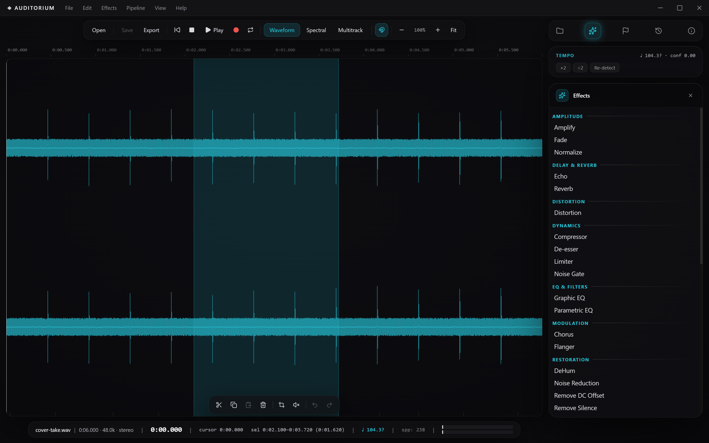
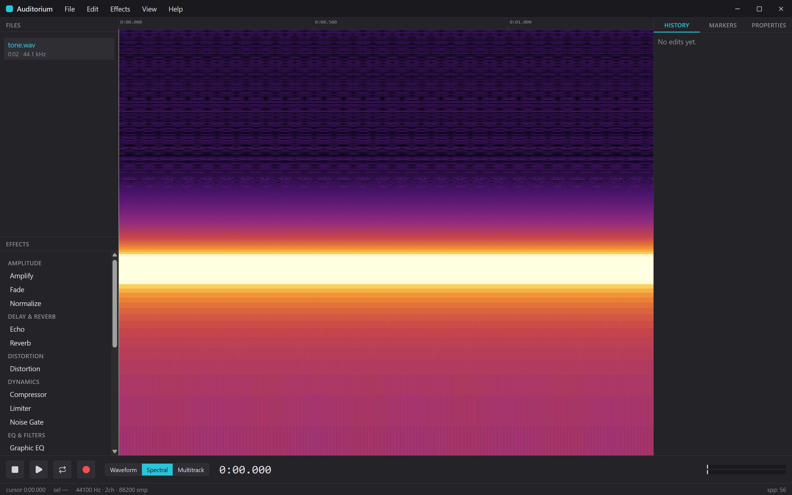

# Auditorium

[](https://github.com/Redrum624/auditorium/releases)
[](https://github.com/Redrum624/auditorium/releases/latest)
[](LICENSE)





*Spectral frequency display (log scale)*

Auditorium is a free, Audition-class desktop audio editor for Windows, built on
Electron and React. It does destructive waveform editing and spectral-frequency
editing, ships 25 built-in effects, spectral noise reduction, a vocal chain
that fixes a rough take in one pass with settings derived from the recording
itself, microphone recording, a multitrack editor with sessions, mixdown and
volume/pan automation envelopes, tempo detection, tempo matching and
auto-remix, stem
separation that splits a track into drums/bass/vocals/other and a residual
which add back up to the original sample for sample, speech transcription
with speaker labels that exports as SRT or WebVTT, a voice changer, lyric
alignment that places every word of a set of lyrics against the recording so
you can replace one of them by singing it again, and a cover chain that matches
a vocal you just recorded to the separated original singer's tone and level —
all processing runs locally, no cloud and no account.

## Install

### From a release (recommended)

Download **`Auditorium Setup <version>.exe`** from the project's GitHub
**Releases** page and run it. The installer is not code-signed, so Windows
SmartScreen may warn the first time you run it — click **More info**, then
**Run anyway**. The installer is an NSIS wizard:

1. Run `Auditorium Setup <version>.exe`.
2. Choose an install location (the wizard lets you change the default).
3. Finish — a desktop shortcut named **Auditorium** is created. Launch it from
   the shortcut or the Start menu.

A plain-text `Auditorium <version> README.txt` ships next to the installer.

### Build from source

Prerequisites: [Node.js](https://nodejs.org/) 20.19+ (or 22.12+) and Git on
Windows x64.

```bash
git clone https://github.com/Redrum624/auditorium.git
cd auditorium
npm install
npm run build:win
```

The versioned installer is written to `release/Auditorium Setup <version>.exe`
(with its `README.txt` beside it). To run the app unpackaged during development,
use `npm run dev`.

## Modules

- **Waveform Editor** — the default per-sample amplitude view with zoom, scroll, selection, cursor, and playhead.
- **Spectral Frequency Display** — an off-main-thread spectrogram (logarithmic frequency axis by default, toggleable to linear, inferno color map, HiDPI-rendered) of the active document.
- **Multitrack Editor** — a session timeline of tracks and clips with per-track volume/pan/mute/solo/arm, draggable, trimmable clips carrying non-destructive edge fades and crossfaded overlaps, multi-clip selection (`Ctrl+Click`, `Shift+Click` range, `Ctrl+A`) with cross-track group drag, delete and ripple delete, clip-edge and `Home`/`End` cursor navigation, per-track automation envelopes (volume, pan, and the three spatial parameters) edited on the lane itself, and full session undo/redo (one step per gesture).
- **Spatial Panel** — a playhead-following positioner (opened from `Effects → Spatial Positioner`, or the Mix row in the Effects card) that places a track's sound around the listener by azimuth, elevation and distance — a stereo projection (amplitude pan + distance level, not binaural) — writing automation keys on release.
- **New File Dialog** — `File → New`: name, sample rate, mono/stereo and a duration in seconds, creating an empty silent document to record or paste into.
- **Recorder** — `File → Record`, or the transport bar's record button: a record dialog with input-device selection, channel/sample-rate choice, and a live input-level meter.
- **Effects Rack** — a categorized effects panel and menu; each effect opens a parameter dialog with a preview before applying. The menu closes with the Spatial Positioner as its own Mix group, and the panel lists the Pipeline tools below the effects — Tempo & Timing, Voice and Analysis, then that same Mix row — one click each, greyed by the same rule the menu uses.
- **Pipeline Module** — a module-strip card listing the ten long-running tools, in the Pipeline menu's own three groups (Tempo & Timing, Voice, Analysis), one click each and greyed by the same rule the menu uses. Choosing one opens the tool IN the module column, in place of this list.
- **Pipeline Menu** — the top-level menu holding the same ten tools, grouped by subject: Detect Tempo, Match Tempo, Align Vocal Timing and Auto-Remix; Voice Changer, Vocal Chain, Cover Chain and Align Lyrics; and Transcribe and Separate into Stems.
- **Files Panel** — the list of open documents (name, dirty marker, duration, sample rate), opened from the module strip.
- **History Panel** — the undo history of whatever is active (the session's in the multitrack view, the active document's elsewhere); click any entry to jump to that state.
- **Markers Panel** — the active document's marker list with jump-to, inline rename, and delete.
- **Module Strip** — the horizontal icon strip at the top right, sitting on top of the module column: Files, Effects, Pipeline, Markers and Properties always, plus Remix while a remix document exists, and History always last. Files is the card the app opens with. Clicking the open entry closes its card and the waveform stretches across the column's width. Spatial and Transcript are not modules — they are opened by command instead: Effects → Spatial Positioner, and Pipeline → Transcribe.
- **Edit Toolbar** — an icon-only pill floating above the status bar whenever a file is open, carrying Cut / Copy / Paste / Delete, Trim / Silence and Undo / Redo, each greyed per its own menu rule rather than hidden.
- **Properties Panel** — read-only facts about the active document or selected clip (path, rate, channels, bit depth, duration, selection, detected tempo).
- **Transport & Level Meters** — play/pause/stop, record, loop, the view toggle and a zoom cluster in the top toolbar pill; the active file's name, duration, rate and channels, the time readout and the output level meters in the floating bottom status pill. Both pills are centred on the waveform, not the window.
- **Tempo Readout** — the status pill's `♩ BPM`, the TEMPO card between the module strip and the panel card, and the Properties panel's Tempo row, showing the detected tempo with its confidence, a staleness marker, and ×2 / ÷2 buttons that re-track the beat grid at the corrected period.
- **Match Tempo Tool** — source BPM (prefilled from the detection, re-detectable from the selection), target BPM or ratio, the stretch-quality band, an optional beat-marker grid at the new tempo, and a **Correction** choice between one ratio for the whole region (the default) and following the tracked beats, which for varying material reports the beat count, the range of local ratios, the resulting duration and how many beats the ratio bound held back, behind a confirmation that gates Apply.
- **Align Vocal Timing Tool** — the beat grid the correction will use (BPM derived from the tracked beats, its confidence, ×2 / ÷2 re-tracking) with a confirmation that gates Apply, a subdivision picker labelled with the median move each choice implies, the syllable markers that will move with their median and largest offsets, a Strength slider, and a warning naming how many moves the stretch bound will hold back.
- **Align Lyrics Tool** — paste or load the lyrics you already know are in the recording, run the alignment (a one-time 378 MB model download with byte progress), and get every word laid out on the line it was written on; click a word to hear exactly that word, then record a fresh take of just that word and splice it in with its level, median pitch and seams matched to what was there. The measured placement accuracy is stated before you commit, a warning appears when the lyrics do not appear to match the audio, and nothing in it ranks, scores or flags any word.
- **Vocal Chain Tool** — the eleven correction stages listed in the order they run, each with the note saying why it sits there and why it is on or off, each switchable on its own (plus the two manual steps — Align Lyrics and Align Vocal Timing — listed in their place with the reason they are yours to run rather than the chain's); after the pass, each stage reports the settings it worked out and what it measured them from, what it changed (RMS, peak, how much of the audio it left bit-identical), or the measurement that made it decline to run; plus a before/after table of loudness, peak, crest factor and noise floor.
- **Cover Chain Tool** <!-- CP1 --> — two document pickers at the top (the original song and your vocal take) and the six stages of the whole journey as the body: separate the original, clean the take with the Vocal Chain, align with the original, match to the original vocal, build the session, smooth and check the level. Each stage carries the note saying why it sits there; the two stages that ARE chains nest their own chains' stages — live while running and in full afterwards — instead of collapsing eleven stages behind one bar. Cancel works between stages and the tool says, before the run, what a cancelled run leaves behind. The measured caveats are stated ABOVE the button (the bed still contains the original singer, the match is a shaping and not a transformation, a single take still has to be a good take, the alignment is a placement and not a warp, and key and tempo are not decided for you — on the song this was measured on the drums read ~160 BPM while everything else read ~109, so an automatic pick would have been a coin flip), and afterwards the report names the session it built, every undo entry the pass left, and why there is deliberately no single entry that undoes all of it.
- **Auto-Remix Tool & Remix Panel** — the tool analyses the track and takes tempo/time-signature confirmation, phrase length, target length, crossfade, strictness and repeat options; the Remix panel (whose module-strip entry appears as soon as a remix document exists) lists one row per splice with a cost-coloured quality dot, Go To, Reject, Pin, Nudge earlier/later, Re-roll and Revert to auto.
- **Separate into Stems Tool** — the one-time 166 MB model download with byte progress, the five track names and both guarantees stated up front, per-segment separation progress with a time estimate, Cancel, and an honest post-run note when a source above full scale means the five tracks cannot add back to it exactly.
- **Transcribe Tool** — the one-time ~323 MB model download with byte progress, the speaker count chosen up front (auto, or 1–6), the measured limits of speaker separation stated before you commit, phase-by-phase progress with a time estimate, and a Cancel that kills the inference process.
- **Transcript Panel** — the active document's transcript, shown by running `Pipeline → Transcribe` on a document that already has one: one row per spoken segment with its time, speaker and text, a Go-to that moves the cursor, a speaker-count control that re-groups instantly without re-transcribing, a warning when the audio has changed under the transcript, and SRT / WebVTT export.
- **Voice Changer Tool** — the one-time 161 MB model download with byte progress, the saved voice-profile list with add-from-file and add-from-selection, the consent affirmation that must be set before a reference clip can be saved or a conversion started, what the feature does and does not promise stated up front, progress with a time estimate, and a Cancel that kills the inference process.

## Features

**Effects (25), grouped by category:**

- **Amplitude** — Amplify, Normalize, Fade.
- **EQ & Filters** — Parametric EQ, Graphic EQ.
- **Dynamics** — Compressor, Limiter, Noise Gate, De-esser.
- **Delay & Reverb** — Echo, Reverb.
- **Modulation** — Chorus, Flanger.
- **Distortion** — Distortion.
- **Restoration** — Remove DC Offset, DeHum, Noise Reduction, Remove Silence.
- **Stereo** — Channel Mixer, Pan.
- **Time & Pitch** — Time Stretch, Pitch Shift, Pitch Correct.
- **Utility** — Invert, Reverse.

**Editing & workflow:**

- Cut, copy, paste, and delete on sample-accurate `[start, end)` selections, from the menu, the keyboard, or the floating edit toolbar — which also carries Trim to Selection and Silence Selection (both in the Edit menu under Delete, neither on the keyboard), and greys each verb by the same rule the menu uses.
- **Launch splash**: starting Auditorium puts a window on screen straight away, showing the app's mark, its version and the stage startup has genuinely reached — services and audio engines ready, the editor's document arriving, its bundle finished loading, its first frame painted — then hands over the moment the real UI is committed. Each of those is reported when it actually happens, so the bar never shows a stage you cannot see, and it only ever climbs. The window is shown at the *later* of Electron's first-frame signal and the renderer's own, so the splash overlaps the wait that already existed instead of adding one: **measured over four launches per side on the same machine, launch-to-window-visible went 1255 ms → 1068 ms (all runs) and 1137 ms → 1067 ms (excluding each side's cold first run), against a ±190 ms run-to-run spread** — no added latency, and the difference is inside the noise either way. If the renderer never reports ready, the editor is shown anyway after 5 seconds (20 under `npm run dev`, where a cold Vite legitimately takes longer), with a reason on the splash when the window never painted at all.
- **Waveform-anchored chrome**: the toolbar, status and edit pills centre on the waveform rather than the window, and closing the open module card hands the column's full width to the lane.
- **Pipeline tools open in the module column, not over the stage**: the nine tools with a UI of their own (Match Tempo, Align Vocal Timing, Auto-Remix, Voice Changer, Vocal Chain, Cover Chain, Align Lyrics, Transcribe, Separate into Stems) mount as a wide card in the module column from any of their three doors — the Pipeline card, the Pipeline menu, the Effects card's tool rows — with the module strip widening to the card's own width (the bar and the open module are always the same width), no backdrop and nothing dimmed, so a multi-stage pass can be watched stepping through beside the waveform while you keep selecting audio, moving the playhead and switching view. While a pass is actually running the module strip and the tool's ✕ refuse, saying why: the progress lives in the tool, so leaving would discard the pass rather than backgrounding it.
- Per-document undo/redo history, up to 50 steps within an 800 MB per-document memory budget (oldest step evicted once either limit is hit), browsable in the History panel; marker add/rename/delete are undoable too (`Add Marker`/`Rename Marker`/`Delete Marker`).
- Session undo/redo for the multitrack: every clip, fade, automation and track edit is undoable, one step per gesture (a whole trim drag, a recorded take, an armed crossfade each revert with one `Ctrl+Z`); `Ctrl+Z` in the multitrack view addresses the session's own 50-step history, in the editor views the active document's — view changes, selection and scrolling are never undo steps.
- Selection by click-drag, double-click (select all), shift-click (extend), `Ctrl+A`, and `Escape` to clear.
- Zoom and scroll on both the waveform and spectral views (mouse wheel, plus the toolbar pill's − / % / + / Fit cluster), sharing one cursor/selection/playhead.
- Session markers: drop with `M`, rename inline, jump to next/previous, list in the Markers panel. Markers persist to disk in every supported container: `.wav` (cue/adtl chunks, Unicode names), `.mp3` (ID3v2.3 chapter frames), `.flac` (VORBIS_COMMENT chapter tags), `.ogg` (OpusTags chapter comments), and `.audm` sessions — sample-accurate on reopen. Destructive edits (delete, paste, trim, replace, sample-rate conversion, length-changing effects) remap or drop marker positions along with the audio, clamped to the document length.
- **Convert Sample Rate / Convert Channels**: `Edit → Convert Sample Rate…` resamples the whole document to a chosen rate (22050/44100/48000/96000 Hz), rescaling markers in lockstep; `Edit → Convert Channels…` converts Mono ↔ Stereo, and for a surround document offers the downmix law below. Both are undoable.
- **Surround WAV import & selectable downmix**: spec-conforming multichannel WAVs (`WAVE_FORMAT_EXTENSIBLE` 5.1/7.1, PCM or float) open with all channels and their speaker layout (`dwChannelMask`); Convert Channels then downmixes to stereo with either the default −3 dB fold (unchanged from earlier releases) or, opt-in when the layout is known, the ITU-R BS.775 matrix (centre and surrounds at −3 dB, LFE discarded per the Recommendation).
- Loop-playback toggle in the toolbar pill (`transport.toggleLoop`).
- **Noise-print workflow**: capture a noise print from a selection, then Noise Reduction subtracts it from the target region.
- Recording device selection, channel count, and sample rate in the record dialog.
- **Export**: WAV at 16-bit, 24-bit, or 32-bit float; FLAC (16-bit, lossless); MP3 at 128/192/256/320 kbps (CBR); OGG (Opus) at 96/128/192 kbps.
- **Format-faithful Save**: Save re-encodes in place into the source container — WAV (32-bit float; the document's bit-depth metadata is retagged to 32-bit float afterward so Properties reports the truth about the file on disk), MP3 (192 kbps), FLAC (16-bit or 24-bit, rounded up from the source depth — a 20-bit source saves as 24-bit, never truncated), or OGG (Opus-in-Ogg, 128 kbps). The Properties panel reports the source file's bit depth ("16-bit source → 32-bit float"). If WebCodecs is unavailable, an in-place OGG Save falls back to Save As WAV. Save As always writes WAV and replaces the source extension in the suggested name (`song.mp3` → `song.wav`).
- **Atomic in-place saves**: every in-place Save writes to a sibling temp file and only replaces the original once the write completes, so an interrupted or failed save can't corrupt or truncate the file on disk.
- **OGG (Opus) export and save**: a pure-TypeScript, RFC 3533/7845-conformant Ogg muxer pairs with the host's WebCodecs `AudioEncoder` — legacy Ogg Vorbis sources re-encode as Opus (not round-tripped as Vorbis).
- **Native-rate import across container variants**: container-header sniffing covers WAV, FLAC, MP3 (including free-format streams), Ogg first packets (Vorbis, Opus, FLAC, Speex), MP4/M4A (64-bit largesize boxes and non-faststart layouts), WebM/Matroska (EBML, any file size — a v1.14 fix; before it, every finalized WebM/Matroska file over 512 KB silently decoded at 48000 Hz), and raw ADTS/AAC, so files keep their native sample rate on open; only genuinely unrecognized layouts fall back to 48000 Hz.
- **Marker persistence in every format**: WAV cue/adtl (UTF-8 label fallback for non-Latin names), MP3 ID3v2.3 CTOC/CHAP chapters, FLAC and OGG vorbis-comment `CHAPTERxxx` tags (readable by chapter-aware players; support varies by player and container) — each alongside a sample-accurate private tag so markers reopen exactly where they were dropped.
- **Spectral log/linear toggle**: the Spectral Frequency Display's frequency axis switches between logarithmic (default) and linear scaling.
- **Multitrack punch-in recording**: arm one or more tracks with their **R** toggle, position the multitrack cursor, then press **Record** — the take lands as a clip on every track that was armed when it started.
- **Sessions**: save/open multitrack sessions as `.audm` (format v3 — a binary layout with no size-limited base64 encoding, so Save Session no longer fails silently on large embedded audio; older v1/v2 session files still open), and mix down a whole session to a new stereo document.
- **Session rate adoption**: an empty session takes the sample rate of the first file placed on it, so clips land at ratio 1 with nothing to resample (undoing that insert restores the previous rate, cursor and zoom together); a session already holding a clip keeps its rate, and any genuinely mixed-rate clip is converted once at insert time, off the play path.
- **Clip fades**: every multitrack clip carries non-destructive fade-in/fade-out — corner handles on the selected clip, exact length fields and a curve picker (Equal power / Equal gain / Smooth / Ducked) in the Properties panel — applied identically in live playback and Mix Down, saved in the `.audm`, and re-editable at any time.
- **Crossfades**: dragging a clip into a same-track neighbour commits the overlap verbatim and arms a real crossfade (both facing fades span the overlap; the pair is rendered with the same correlation-compensated, level-preserving gain law Auto-Remix uses); moves and trims re-arm at the new width, Arm/Release manage it from the Properties panel, and holding Ctrl at the drop restores the old push-clear nudge. A fade-carrying session still opens in v1.8.0, minus the fades.
- **Clip editing (Audition-style)**: `Ctrl+Left` / `Ctrl+Right` walk the multitrack cursor over the session's clip edges — from inside a clip that is its start and its end, and beyond them the union of every track's clip boundaries, so a keypress is never dead; `Home` and `End` put it at the session start and at the end of the last clip; `Ctrl+Click` builds a selection of several clips across tracks, `Shift+Click` extends it to a range along one track, and `Ctrl+A` takes every clip in the session (a plain click collapses it, `Escape` clears it), which then **drags as one rigid group** — every member previewing the move live, and following the pointer **onto other tracks** while keeping the group's shape, or refusing the lane change outright rather than scattering — and **deletes as one undo step**; and `Shift+Delete` is **Ripple Delete** — the selected clips go and every later clip on each affected track slides up to close the gap, with any overlap that shift creates arming a crossfade exactly as a drag would.
- **Track automation**: per-track volume and pan envelopes — keys on the multitrack timeline with per-segment curves, edited directly on the lane (click to add, drag to move with snapping, right-click to delete, double-click to change the curve); an active envelope overrides its fader, plays and mixes down with bit-identical gains, and saves in the `.audm` (a lane-free session stays byte-identical on disk, and an automation session opens in v1.9.2 and round-trips through it with the lanes preserved — v1.9.2 just cannot edit or play them).
- **Spatial placement**: drag a track's sound around the listener in the Spatial panel — azimuth, elevation and distance automate on the timeline like any other lane, render as a stereo projection (amplitude panning plus inverse-distance level; honestly named — not binaural, no HRTF), supersede the pan control while active, interpolate azimuth the short way around the ±180° circle (add an intermediate key for a deliberate long sweep), play and mix down bit-identically, and save in the `.audm` at the same format version.
- **Pitch Correct**: scale-snapped pitch correction — a YIN pitch detector tracks the sung/played line, snaps each voiced frame to the chosen key and scale (chromatic, major, or natural minor) with adjustable Strength and Retune Speed, and resynthesises through a time-varying stretch+resample pair that preserves the input length exactly.
- **Remove Silence**: detects pauses under a threshold and either shortens each to a target length or removes it (keeping padding), splicing every cut with a click-free crossfade and remapping markers by the exact material removed before them — a marker inside a removed pause snaps to the splice point instead of being lost.
- **Fade effect curves**: the destructive Fade effect gains the Equal power curve and a ramp-length control (% of the selection); its "Exponential" option is now labelled **Ducked** — the shape is quadratic, and the new name describes what it sounds like.
- **Tempo detection**: `Pipeline → Detect Tempo` runs a shared off-thread beat-tracking pass (log-band spectral-flux onsets → harmonic-comb tempo estimate → Ellis dynamic-programming beat tracking → sample-accurate refinement) and reports the BPM plus a confidence score in the status pill and the Properties panel. The beats are tracked, not extrapolated, so the grid follows a drifting take; ×2 / ÷2 buttons re-track at the corrected period when the octave is wrong. Whole-document analysis is capped at 10 minutes and flags the result as truncated past that.
- **Beat grid**: once a tempo has been detected, the tracked beats are drawn as tics along the bottom of the waveform and spectral editors and on every multitrack clip (mapped through the clip's own offset, trim and sample rate), so you can see where the beat actually falls rather than inferring it from a BPM number; a stale or low-confidence grid is drawn dimmed and dashed rather than as fact, bar lines appear only when an Auto-Remix analysis genuinely measured a metre, stems inherit their source's grid instead of being re-analysed, and `View → Toggle Beat Grid` switches it off.
- **Snapping ("the magnet")**: the cursor, the moving edge of a selection, and multitrack clip drags and trims quantise onto the nearest target within 8 screen pixels — in the multitrack that means the *other* clips' edges (a sample-exact butt join is a plain drag), their beats and markers, and the session cursor, with placed geometry outranking derived (edge/cursor over marker over beat) when both are in reach — hold **Alt** to suspend it for a precise off-grid edit, or switch it off entirely with the toolbar magnet button or `View → Toggle Snap to Grid`.
- **Draggable cursor handle**: the red triangle at the top of the cursor is grabbable in all three views — Waveform, Spectral and the Multitrack, same geometry and colour from shared constants so the views cannot drift. Grabbing alone moves nothing; the drag follows the magnet (whole samples, snap before clamp — hold **Alt** to suspend it), and releasing never touches the transport — during playback the handle stays parked at the cursor while the playhead sweeps.
- **Align Vocal Timing**: `Pipeline → Align Vocal Timing` warps a sung take so its syllables land on the beat — the thing Match Tempo structurally cannot do, because Match Tempo applies one ratio to the whole region and a singer who drags in one line and rushes in the next needs a different rate in each. You mark the syllables (ordinary markers), pick the grid and its subdivision, and the warp is applied between those confirmed anchors through the same variable-rate, pitch-preserving stretch Pitch Correct uses. The correction strength defaults to 25 %, not 100 %: a fully quantised vocal sounds machine-made, and 25 % is the largest strength at which none of the measured inter-syllable spans on a real take leaves the stretch's transparent band. Local stretch is clamped to 0.88–1.14× and any move the clamp holds back is named before you apply. **Suggest syllable markers** runs an onset detector and writes its proposals in as markers to edit — a proposal, not a decision: measured against hand-marked attacks on a real 142-second solo vocal it gets roughly one anchor in eight wrong and finds about two thirds of the syllables, which is exactly why nothing it produces reaches the audio without you keeping it.
- **Align Lyrics, and replacing a word without redoing the take**: `Pipeline → Align Lyrics` places lyrics you already have against a recording and gives every word a position, using a wav2vec2 character-CTC model locally on the CPU — no cloud, no account, nothing leaves the machine. Click a word to hear exactly that word; pick one, record a fresh take of just that word, and it is spliced in with the silence trimmed off it, its level and median pitch matched to the word it replaces, and the crossfades placed OUTSIDE the word span so none of the old one survives underneath the new one. The splice changes no sample position, so a backing track still lines up and the next word can be replaced without re-running the model. **What the placement is worth, measured:** word starts land within a median 20 ms, and 88 % of them within 100 ms — measured as the agreement between two acoustic models that share no training data, label set or size, over 51 sung words of one performance by one singer. Speech is easier (91 % within 100 ms on the 22-word spoken control), so a script against a recording is a real use. **It does not assess pronunciation and does not pretend to:** a per-phone scorer was built and measured on this same material at AUC 0.642 against a 0.500 chance baseline, flagging 46 of 51 words, and was cut — your ear picks the word, the tool makes it reachable. Because forced alignment always returns a position for every word, including the wrong ones, a warning appears when the lyrics do not appear to match the audio; it is a warning and never a refusal, and the positions are shown either way. Replacements come from the microphone only. The 378 MB model is downloaded on first use (sha256-pinned, re-verified before every load), inference runs in an isolated process with progress and a Cancel that kills it outright, and a run is capped at 20 minutes of audio.
- **Vocal Chain**: `Pipeline → Vocal Chain` runs the corrections a rough vocal usually needs as one pass and one undo entry — DC offset, noise reduction, de-hum, optional silence removal, a noise gate, pitch correction, compression, de-essing, a high-pass, limiting, and optional reverb, in that order. **It adds no new processing:** every stage is an effect that already shipped. What it adds is the ordering, settings derived from the recording itself, and a report. Nothing is set by taste: the de-esser's threshold is measured at its own input after the compressor (an absolute threshold is right when you are turning the knob with Listen and wrong when nobody is), the compressor's threshold is the level the take is above half the time while it is sounding and its makeup gain is exactly the level the compression removed, the noise print is learned from the quietest 500 ms of real material in the selection — never from digital silence, whose spectrum describes the zeros rather than the room, and reading a diluted window was measured leaving 4.7–8.3 dB of the stage's 12 dB unused — the silence threshold is the loudest that passage ever reads, and the high-pass sits an octave under the lowest note actually sung. **The pauses between phrases reach actual silence**, which no earlier version could do: noise reduction bottoms out 12 dB down and the compressor's makeup lifts what is left, so the gate is the stage that finishes the job — muting in place rather than cutting, so the take stays lined up with a backing track. **The gate decides WHERE, not how loud.** Earlier releases derived a level and muted everything under it, which meant the noise in your pauses had to be *quieter* than your softest singing — and on a real take it often is not: a chair, a fan, a neighbour's TV can all sit above a pianissimo phrase. The stage now asks where the vocal activity is and mutes a stretch only when the evidence says none lives in it, so pause noise louder than your softest singing still goes, which no threshold could ever reach. The evidence, in the order it is consulted: **your aligned lyrics or transcript place the words** — if you have run Align Lyrics or Transcribe on this audio and not edited it since, nothing inside a word span is ever muted, however quiet the word, the only evidence that can protect singing too quiet to measure; **every half-second is measured for a vocal tract** — a whisper, a breath, a held consonant carries resonances a room's noise does not, and any stretch showing them is kept whether or not a word maps there; and **anything voiced is kept** — if the pitch detector reads voiced frames in a candidate stretch, the whole stretch stays. Only stretches of at least 500 ms qualify — the shortest gap this app is willing to call a pause at all — so a stop-consonant closure, a breath gap or a dip inside a held note is never even a candidate. **Digital silence is left exactly as it is**: zeros stay zeros, a run of exact zeros is never *evidence* about the material beside it (silence next to a whispered line cannot pass that whisper off as room tone), quiet audio surviving only as fragments between zeros — an 8-bit transfer, a strip-silenced stem — is never muted unheard, and a take whose pauses are already exact zeros declines, having nothing left for a gate to do. **And when nothing qualifies, it declines instead of guessing**: a take that never pauses for half a second is left alone entirely, a take where every candidate stretch carries vocal evidence declines and says which evidence kept them, and a take that reads as one long noise floor declines rather than muting all of it — every refusal ends in a stated reason, an untouched recording, and a way out: **you can set the gate's threshold yourself** — tick *Gate at a level I set instead* on the Noise Gate row and name a level in dBFS — because no measurement can tell an unshaped breath from room tone and "no word, no sound" has to stay reachable anyway. It is the one setting in the chain that comes from a person, so the row says **Threshold (manual)** and reports how many seconds that level will actually silence; everything else about the stage is unchanged. **Stages that have nothing to do say so rather than running anyway** — on a recording with no mains hum the DeHum stage reports the two readings it took and declines. Remove Silence and Reverb are off by default because they change the material rather than correct it (removing pauses shifts everything after them out of sync with a backing track), and the two manual stages — Align Lyrics and Align Vocal Timing — are listed but never run automatically: each needs you to say *what* to change (which word, which syllables), so each is a step you run first. Align Lyrics sits second in the order, right after DC offset: a replacement is a fresh microphone take carrying its own room tone, so it has to be in the file before Noise Reduction learns its print and before the level stages measure what they set themselves from, and it has to come before Remove Silence and Align Vocal Timing, which move every sample after the point they edit. Measured end to end on a real 142-second solo vocal: noise floor −61.3 → −67.4 dBFS, pitch deviation from the nearest semitone 23.3 → 14.7 cents (median), programme level held to within 0.2 dB, length unchanged, ~105 s of processing.
- **Cover Chain**: `Pipeline → Cover Chain` <!-- CP1 --> takes the original song AND your vocal take and does the whole journey unattended — separate, clean, align, match, place, smooth — reporting what every stage measured. **Separation** runs the model over the song (or REUSES its stems when they are already open, and says which it did) and sums the four non-vocal stems into an instrumental; that sum is exact rather than approximate, because separation's one hard guarantee is that its five outputs add back up to the mix to the last bit. **The Vocal Chain** then runs on your take with its eleven stages nested in the stepper, the pauses between your phrases gated to silence in place so nothing shifts out of sync. **Alignment** cross-correlates the app's own onset envelope of your take against the separated original vocal's — a coarse pass at a fixed 22.05 kHz analysis rate decides where and whether to believe it, and a fine pass at each file's own rate refines it inside ±0.2 s — and reports the offset with the two measured thresholds it had to clear. **The reference is the separated vocal, and deliberately not the song.** Refining against the original song was built, shipped and withdrawn: the two share a timeline exactly, but they do not share ONSETS, because an onset envelope is spectral flux and accompaniment sitting under a vocal dilutes the flux at the vocal's own attacks. Measured on the shipped fixture pair as the bed is swept from 52 dB under the vocal to 8 dB under it, the separated vocal recovers the built-in offset to 0.07 ms at every level, while refining against the song costs 3.3 ms to 12.9 ms — growing with the accompaniment, and past the ±10 ms promised above at an ordinary pop balance. The error it adds equals the lag between the two rulers' onsets at every level, which is also why there is no correction for it: measuring that lag and subtracting it returns the separated vocal's own answer. The whole sweep is kept as a test. **The take it measures is the one you recorded, not the cleaned one**: those samples are snapshotted before the Vocal Chain touches them, because the measurement reads onsets and the chain writes its own — the noise gate puts an attack at every open and close the original never had, and the pitch corrector moves the real ones (only the samples come from before the chain; the take document still supplies the sample rate). **Below the thresholds it still places the tracks for you**, because the measured guess is the best evidence there is and a user who has to click a button to accept it has been asked a question the pass could already answer: a match the aligner calls *ambiguous* or *weak* is placed at its own measured lag with the same both-tracks-move arithmetic a believed alignment uses, and its rival lags stay one click away underneath as **Place at ±X s** rows (“placed at −8.257 s — if that is the wrong spot, these matched too”). Only *unrelated* — a take no arm could distinguish from the measured unrelated band — and a measurement that classified itself not at all are still placed at the start with the numbers stated, and those carry the single **Apply the measured offset anyway** button instead. Every one of those presses re-places both clips as one undoable gesture, and the align row's own sentence names the control that is actually on screen for that measurement. The refusal's own advice is sign-aware, because it has to be: a clip cannot start before zero, so a NEGATIVE guess can only be realised by dragging the *instrumental* later, and the message says so instead of naming the take (it no longer suggests Align Vocal Timing either, which warps document audio to a beat grid and cannot move a clip at all). Known offsets are recovered to within 10 ms in both signs, at equal sample rates and across 44.1/48 kHz, **at a normal take level** — the accuracy is level-dependent and the claim breaks quietly: 8.4 ms at unity, 10.9 ms at −40 dB, 21.6 ms at −70 dB, and the alignment is BELIEVED at all three, so a very quiet take gets a silently-off placement rather than a refusal (KNOWN_LIMITATIONS has the table). It is a **placement, not a warp**: nothing is stretched, and Align Vocal Timing and Align Lyrics stay manual because each needs a decision only you can make. **Matching** is the four stages below, unchanged. **Placement** builds a two-track session — the instrumental and your matched take at the aligned offset, with both tracks pushed later rather than your take clamped to zero if it belonged before the original's start. **Smoothing** puts 25 ms edge fades on the take and mixes the session down once to measure the summed peak BEFORE the master bus's clamp, because the clamped render peaks at 0 dBFS by construction and could never show it; over full scale the pass **takes its own overshoot back out** rather than handing you the arithmetic — both faders come down by the same amount (plus 1 dB of headroom), the trimmed session is summed a second time to state the measured result rather than promise it, and the whole thing is one undo entry, `Cover level trim`, on the session's own history. Equal on both, so the balance Match Loudness set survives it; a session that already fits is never touched, and a sum that fits is never brought *up* to a target. Cancel works between stages, and the session is built only at stage 5, so cancelling earlier leaves documents and no session. Each sub-pass keeps its own undo entry.
- **The matching stages**: matching a new vocal take to the vocal on the record you are covering, in one pass and one undo entry. The hard part is not what it sounds like: separation hands over the *processed original vocal as a signal*, so "work out what was done to the voice in the mix" becomes matching against a reference. **Match EQ** compares the long-term octave-band energy of the two and realises the difference on the Graphic EQ — from 500 Hz up only and bounded to ±10.9 dB, both measured against ground truth (below 500 Hz the separated reference is mostly not the vocal: at 125 Hz its own separation error *exceeds* it by 5.1 dB, and the unrestricted curve asks for its biggest boosts exactly there). **Match Loudness** moves the take to the original vocal's level measured over the sounding parts of each — an ungated comparison of the same two files is biased 0.7 dB purely by how much silence each contains. A **Limiter** owns the headroom the loudness match has no view on, **last of every stage that touches the audio** so nothing downstream can lift the output back over its −0.3 dBFS ceiling; switch it off and the loudness stage names the peak it is about to produce rather than clipping silently. **Match Reverb** ships as a stage that usually *declines*, deriving the refusal: it estimates the original vocal's decay by ISO 3382-1's T20 method (validated against the app's own reverb at 1.26 s where the closed form says 1.45 s, and 2.92 s where it says 3.20 s) and compares it with the shortest decay this app can produce — 0.40 s against a 0.710 s floor on the reference song, so it says so instead of adding twice the space that is there. **The curve you are shown is the one the audio received**: the Graphic EQ is a cascade of overlapping filters whose gains are not its response, so the band gains are pre-compensated to deliver the requested *band energy* — measured in **your take's own spectrum**, because how much energy a filter takes out of an octave depends on where inside it the signal sits — and the realised figure is reported next to the requested one, including the shortfall with both numbers when a band cannot be reached inside the EQ's own ±12 dB. **There is no matched compressor**, because the move one would ask for changes sign across the analysis gate (+0.43 / −0.88 / −3.55 / −9.71 / −6.71 dB at 15 / 20 / 25 / 30 / 40 dB); the envelope spread is reported and nothing is derived from it. Two tools remain manual by design — Align Lyrics, because nothing in the app judges which word came out wrong, and Align Vocal Timing, because it needs a confirmed beat grid — and each says why; everything else the chain used to list as your job is now stage 1, 2, 5 or 6 of the journey above. Measured end to end on a real 142-second solo vocal against a real song: loudness −25.96 → −16.35 dBFS (target −16.35), spectral distance from the original vocal 1.94 → 0.34 dB, peak −9.68 → −0.84 dBFS, envelope spread 13.62 → 12.92 dB. **The instrumental you lay the cover over still contains the original singer** — 17.95 dB below the music, 9.5–11.8 dB below it across 250 Hz–4 kHz, worst measured second 8.9 dB — and the tool says so before you run it.
- **Match Tempo**: `Pipeline → Match Tempo` retargets a selection (or the whole document) from a source BPM to a target BPM or a plain ratio through the WSOLA time stretch, showing whether the resulting stretch is transparent, good, or extreme, and optionally laying down a beat-marker grid at the new tempo as its own undo step.
- **Match Tempo on material whose tempo moves**: the same tool's **Correction → "Follow the tracked beats"** builds a tempo *map* from the confirmed beat grid and moves each tracked beat onto the target grid individually, instead of sharing one ratio between them. Measured on synthetic accelerandi with exact ground truth, against the most favourable single ratio available, the worst interior beat lands **104 ms → 4.6 ms** off at a 0.17 BPM/s drift, **526 ms → 4.6 ms** at 0.83 BPM/s (526 ms is 0.96 of a beat), and **1274 ms → 9.8 ms** at 2.08 BPM/s; on a perfectly steady grid it reproduces the one-ratio result byte for byte. It is opt-in and the default is unchanged, because a steady loop does not want per-bar correction — and because a wrong single ratio is uniformly wrong and audible at once, while a wrong tempo map is wrong differently in every bar. It is therefore only ever built from a grid you have confirmed, and the tick is cleared by every ×2 / ÷2 re-track and every re-detect. Local ratios are bounded by the same 0.25–4× limit the one-ratio path enforces, per beat interval, and any beat the bound holds back is counted before you apply.
- **Auto-Remix**: `Pipeline → Auto-Remix` re-arranges a track's own bars to reach a requested length and writes the result to a new `Remix N` document, leaving the source untouched. Bar boundaries come from the tracked beats; each boundary is described by timbre, chroma, loudness and local rhythm and clustered into sections, and a 2-D lattice dynamic program picks the cheapest phrase-congruent arrangement (Φ = 8 bars by default) reaching the target. Joins are micro-aligned by ±10 ms cross-correlation and crossfaded with a power-preserving, length-neutral gain law. The Remix panel then lets you reject, pin, or nudge any individual splice, re-roll the whole arrangement, or revert to the automatic one — every adjustment undoable from the History panel. A pin is a hard constraint: up to four pinned splices are guaranteed to survive every re-plan and re-roll, and any pin that cannot be kept is named with the reason (rejected, not a legal splice, incompatible with the other pins, or more than four pins). You may still press up to eight, but past four the planner cannot enforce any of them — the whole set reverts to the old best-effort preference, the panel says so before and after the fifth press, and unpinning back to four restores the guarantee.
- **Stem separation**: `Pipeline → Separate into Stems` splits the active document into **Drums, Bass, Vocals, Other** and a **Residual**, creating five documents and a five-track multitrack session. The five tracks add back up to the original **sample for sample** — the model's estimates are only used to build ratio masks over the original document's own spectrum, and the Residual is the time-domain complement `mix − Σ stems`, so mixing the untouched session down reproduces the source exactly (measured: worst error 0, 100 % of samples bit-identical, mono and stereo, 44.1 and 48 kHz). How cleanly the instruments are told apart is bounded by the model, and the UI says so rather than promising otherwise. The 166 MB model is downloaded on first use (sha256-pinned, re-verified before every load), inference runs on the CPU in an isolated process with per-segment progress and a Cancel that kills it outright, and separation is capped at 15 minutes of audio.
- **Transcription with speaker separation**: `Pipeline → Transcribe` turns speech into timestamped text with a speaker label per segment, using Whisper (base) and a CAM++ speaker-embedding model running locally on the CPU — no cloud, no account, nothing leaves the machine. The transcript appears in the Transcript panel and as coloured regions on the editor's timeline; clicking either moves the cursor there. Timestamps are kept in document samples, so they line up with the waveform at any sample rate, and export as SRT or WebVTT with the speaker labels. **What the speaker separation is worth, measured:** on clean recordings with one voice at a time it told two speakers apart with 100 % of segments correct and recognised a single speaker as one person every time, but it placed only 45 % of segments correctly with three speakers — 73 % even when told there were three. Overlapping speech is not detected at all: a segment with two voices in it gets one label. The speaker count is therefore a control, not just a readout — set it yourself in the Transcript panel (up to what the recording's own evidence can separate) and the grouping is recomputed instantly, with no second transcription run. A transcript lives for the session only — it is not saved into the audio file or the `.audm`, so export it to SRT or WebVTT before you close. The ~323 MB model set is downloaded on first use (sha256-pinned, re-verified before every load), inference runs in an isolated process with progress and a Cancel that kills it outright, and a job is capped at 2 hours of audio.
- **Voice changer**: `Pipeline → Voice Changer` re-timbres a recording so it sounds like a different speaker while keeping the words and the delivery, using OpenVoice V2's tone-colour converter locally on the CPU — no cloud, no account, nothing leaves the machine. A **reference clip** (a file, or a selection from an open document) is saved as a reusable **voice profile**; the conversion lands as a new mono 22050 Hz document, leaving the source untouched. **What it is worth, measured:** across nine conversions to five real target voices spanning 1.3 octaves, an independent speaker-verification encoder scored the output at mean cosine 0.795 to the target against 0.615 to the source, with 8 of 9 landing closer to the target and none still verifying as the source; self-conversion, a full confusion matrix and pitch-matched rival targets rule out both "generic degradation" and "just a pitch shift". It is a voice *change*, not a forensic-grade clone — expect "recognisably in the target's direction" — and **a reference that already sounds like the source barely moves it**. Intelligibility ran 0–27 % word error rate against the unconverted source, worst at a +8.1-semitone jump. **Choosing a reference clip requires affirming that you have the right to use that voice**, and the conversion is refused until you do — a statement you make, never pre-ticked, placed at the reference-clip picker because that is where the choice that matters is made. The 161 MB model set is downloaded on first use (sha256-pinned, re-verified before every load), inference runs in an isolated process with progress and a Cancel that kills it outright, long inputs are chunked at ~30 s so peak memory stays flat, and a run is capped at 30 minutes of audio.
- **A crash says so**: if the editor hits an error it cannot recover from, you get a card naming what happened — with the error text selectable so it can go into a bug report — telling you to save what you can and offering Reload, instead of a window that stops responding with nothing on it. Exceptions that happen outside the drawing code raise the same card in the corner *over* the app you are still using — dismissible, and it blocks nothing, because a failed background job is not a reason to lose a session or to interrupt a drag. Nothing is sent anywhere: the message exists only on that screen.
- Keyboard shortcuts throughout — see [`KEYBOARD_SHORTCUTS.md`](KEYBOARD_SHORTCUTS.md) for the full table.

See the [User Guide](docs/USER_GUIDE.md) for a full walkthrough and
[Known Limitations](docs/KNOWN_LIMITATIONS.md) for where Auditorium deliberately
differs from Adobe Audition.

## Architecture

The **Electron main process** owns all OS access and is hardened: every
`BrowserWindow` runs with `contextIsolation`, `sandbox`, and `nodeIntegration:
false`, and a preload whitelist exposes only a typed `window.electronAPI` over
IPC — and each window gets only the surface it needs, so the launch splash runs
a two-method preload of its own rather than the editor's. File writes pass
through a fail-closed write-path policy, and the renderer never touches
`fs`/`path` — file bytes travel over IPC as `ArrayBuffer`s.

The **renderer** is React plus canvas. Zustand holds the app state (documents,
selection, zoom, playback, markers); the waveform, spectrogram, and multitrack
views draw to `<canvas>` for interactive, sample-accurate rendering of large
buffers.

The **DSP** is pure, synchronous TypeScript — each effect is a `process()` that
takes and returns `Float32Array` channels and never mutates its input. Heavy
work (effects and spectrogram computation) runs in Web Workers so the UI stays
responsive; the same effect registry is imported by both the app and the worker.

**Stem separation, transcription, the voice changer and Align Lyrics** are the
four exceptions to the pure-TypeScript rule, and they are contained the same
way: neural inference runs on `onnxruntime-node` (CPU execution provider)
inside an Electron `utilityProcess` — one per feature, never shared, each with
its own model directory — so the renderer never loads it and the working set
can be killed instantly on Cancel. Everything built on top of the models is
ordinary TypeScript: the mask/complement DSP that turns stem estimates into an
exact partition, the Ward-linkage speaker clustering that turns voice
embeddings into speaker labels, and the blank-extended CTC Viterbi that turns
an emission grid into per-word spans (plus the length-preserving splice that
replaces one of them). There is no GPU
path: on an RTX 3080 Laptop the DirectML provider never finished a single
7.8 s stem segment before exhausting 15.7 of 16 GB of VRAM, while the CPU
provider runs stem separation at ~1.5x realtime and transcription at ~9x.

## Credits

- **Stem separation model** — **HT-Demucs** (Hybrid Transformer Demucs) by
  **Meta AI**, MIT licensed, used through the **StemSplitio** ONNX export
  ([`StemSplitio/htdemucs-onnx`](https://huggingface.co/StemSplitio/htdemucs-onnx),
  `htdemucs_fp16weights.onnx`, MIT). The model is downloaded from that
  repository on first use and is not bundled with Auditorium.
- **Speech recognition model** — **Whisper (base)** by **OpenAI**, Apache-2.0,
  used through the ONNX export at
  [`onnx-community/whisper-base`](https://huggingface.co/onnx-community/whisper-base).
- **Speaker-embedding model** — **CAM++** trained on VoxCeleb by the
  **WeSpeaker** project, Apache-2.0, taken from the
  [sherpa-onnx speaker-recognition model release](https://github.com/k2-fsa/sherpa-onnx/releases/tag/speaker-recongition-models)
  (`wespeaker_en_voxceleb_CAM++.onnx`). Both are downloaded on first use and
  are not bundled with Auditorium.
- **Voice-conversion model** — **OpenVoice V2**'s tone-colour converter by
  **MyShell.ai** ([`myshell-ai/OpenVoiceV2`](https://huggingface.co/myshell-ai/OpenVoiceV2),
  MIT), used through the third-party ONNX export at
  [`Hinotsuba/OpenVoice-ONNX-v2`](https://huggingface.co/Hinotsuba/OpenVoice-ONNX-v2)
  (MIT, "free for commercial use", following the official OpenVoice V2
  licence). Downloaded on first use and not bundled with Auditorium.
- **Forced-alignment model** — **wav2vec2-base-960h** by **Meta AI**,
  Apache-2.0 upstream at
  [`facebook/wav2vec2-base-960h`](https://huggingface.co/facebook/wav2vec2-base-960h).
  The 378 MB ONNX graph is fetched from the
  [`onnx-community/wav2vec2-base-960h-ONNX`](https://huggingface.co/onnx-community/wav2vec2-base-960h-ONNX)
  export, downloaded on first use and not bundled. **The licence derivation is
  stated rather than glossed:** that mirror repository declares no licence of
  its own, so the Apache-2.0 grant is inherited from the upstream checkpoint it
  was exported from, not asserted by the repository the bytes come from — which
  is why the sha256 pins are load-bearing. The vocabulary (`vocab.json`) is
  taken from the official Apache-2.0 repository rather than from the mirror, so
  only the graph itself rides that derivation.
- **MP3 encoding** — [**lamejs**](https://www.npmjs.com/package/@breezystack/lamejs)
  (`@breezystack/lamejs`, LGPL-3.0), a JavaScript port of the LAME MP3 encoder,
  statically bundled into the app — see
  [`THIRD_PARTY_NOTICES.md`](THIRD_PARTY_NOTICES.md) for the full LGPL-3.0 text
  and the relink-from-source note, alongside every other third-party component,
  model, and ported-code attribution.

## Downloads


## License

[MIT](LICENSE) © 2026 Auditorium contributors.
